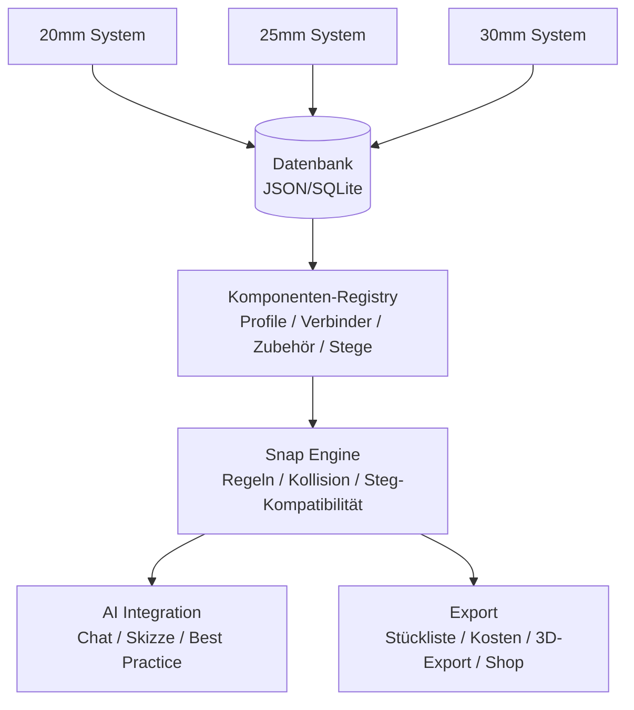

# 🏗️ ALUSTECK BUILDER - Blender Addon

> **Parametrisches CAD-System für Alusteck Stecksysteme mit AI-Integration**

[](https://www.blender.org/)
[](https://python.org/)
[](LICENSE)

---

## 🎯 Vision

Ein **intelligentes Baukastensystem** direkt in Blender, das:

- Exakte Alusteck-Komponenten mit echten Maßen bereitstellt
- Automatisches Snapping mit physikalisch korrekten Verbindungen ermöglicht
- Per **Chat oder Skizze** komplette 3D-Strukturen generiert
- Stücklisten und Kostenkalkulationen exportiert

---

## 📐 System-Architektur



---

## 📁 Projektstruktur

```
alusteck_builder/
│
├── __init__.py                 # Blender Addon Entry Point
├── manifest.toml               # Blender 4.2+ Extension Manifest
│
├── core/
│   ├── __init__.py
│   ├── database.py             # Datenbank-Loader (JSON/SQLite)
│   ├── registry.py             # Komponenten-Registry
│   └── constants.py            # Globale Konstanten & Maße
│
├── components/
│   ├── __init__.py
│   ├── profile.py              # Profil-Mesh-Generator
│   ├── connector.py            # Verbinder-Mesh-Generator
│   ├── accessory.py            # Zubehör-Generator
│   └── materials.py            # Material-Definitionen
│
├── snap/
│   ├── __init__.py
│   ├── engine.py               # Snap-Engine Hauptlogik
│   ├── rules.py                # Verbindungsregeln
│   ├── collision.py            # Kollisionsprüfung
│   └── validation.py           # Konstruktions-Validierung
│
├── ai/
│   ├── __init__.py
│   ├── chat_interface.py       # Chat-Panel in Blender
│   ├── prompt_builder.py       # Prompt-Engineering
│   ├── structure_generator.py  # Text → 3D Struktur
│   └── sketch_analyzer.py      # Skizze → Struktur (Optional)
│
├── ui/
│   ├── __init__.py
│   ├── panels.py               # Sidebar Panels
│   ├── menus.py                # Add-Menüs
│   ├── operators.py            # Alle Blender Operators
│   └── preferences.py          # Addon-Einstellungen
│
├── export/
│   ├── __init__.py
│   ├── bom.py                  # Bill of Materials (Stückliste)
│   ├── cost_calc.py            # Kostenberechnung
│   └── shop_link.py            # Direktlink zum Alusteck-Shop
│
├── data/
│   ├── alusteck_database.json  # Alle Komponenten-Daten
│   ├── snap_rules.json         # Snap-Regeln
│   └── presets/                # Vorgefertigte Strukturen
│       ├── regal_basic.json
│       ├── tisch_standard.json
│       └── rahmen_modular.json
│
└── tools/
    ├── scraper.py              # Web-Scraper für Produktdaten
    └── db_updater.py           # Datenbank-Aktualisierung
```

---

## 🔧 Komponenten-Datenbank

### Struktur (JSON Schema)

```json
{
  "meta": {
    "version": "2.0",
    "source": "alusteck.de",
    "last_updated": "2025-01-15"
  },

  "systems": {
    "20mm": { ... },
    "25mm": {
      "profile": {
        "outer_mm": 25.0,
        "wall_mm": 1.5,
        "inner_mm": 22.0,

        "variants": [
          {
            "id": "VK25-STD",
            "name": "Standard Vierkantrohr",
            "steg": null,
            "price_per_m": 5.90
          },
          {
            "id": "VK25-2SI",
            "name": "2 Stege Innenwinkel",
            "steg": {
              "count": 2,
              "type": "single",
              "position": "inner_corner",
              "height_mm": 15.0,
              "blocks_directions": ["+X", "+Y"]
            },
            "price_per_m": 13.77
          }
        ],

        "schnittbilder": {
          "A": {"name": "Gerade", "surcharge": 0.48},
          "B": {"name": "45° Gehrung", "surcharge": 0.48},
          "C": {"name": "Doppel-Gehrung", "surcharge": 0.69}
        }
      },

      "connectors": [
        {
          "id": "2D25K",
          "name": "Verbinder gerade",
          "type": "straight",
          "ways": 2,
          "socket_depth_mm": 25.0,
          "price": 1.50,
          "ports": [
            {"direction": [0, 0, 1], "offset": [0, 0, 12.5]},
            {"direction": [0, 0, -1], "offset": [0, 0, -12.5]}
          ]
        },
        {
          "id": "3E25K",
          "name": "Eckverbinder 3-Wege",
          "type": "corner_3",
          "ways": 3,
          "socket_depth_mm": 25.0,
          "cube_size_mm": 25.0,
          "price": 2.50,
          "ports": [
            {"direction": [1, 0, 0], "offset": [12.5, 0, 0]},
            {"direction": [0, 1, 0], "offset": [0, 12.5, 0]},
            {"direction": [0, 0, 1], "offset": [0, 0, 12.5]}
          ]
        }
      ],

      "accessories": [ ... ]
    },
    "30mm": { ... }
  },

  "snap_rules": {
    "socket_tolerance_mm": 0.5,
    "auto_align": true,
    "steg_compatibility": {
      "inner_corner": {
        "compatible_connectors": ["corner_3", "corner_4"],
        "blocked_ports": ["+X", "+Y"]
      }
    }
  }
}
```

---

## 🧲 Snap-Engine

### Funktionsweise

```
   PROFIL                    VERBINDER                    PROFIL
     │                          │                           │
     │    ┌──────────────┐      │      ┌──────────────┐     │
     │    │              │      │      │              │     │
═════╪════╡   ZAPFEN     ╞══════╪══════╡   ZAPFEN     ╞═════╪═════
     │    │   (22mm)     │      │      │   (22mm)     │     │
     │    └──────────────┘      │      └──────────────┘     │
     │                          │                           │
     │◄────── 25mm ──────►│◄─25─►│◄────── 25mm ──────►│
     │    Einstecktiefe        Würfel      Einstecktiefe    │
```

### Snap-Regeln

| Verbinder-Typ | Max. Ports | Richtungen | Kollisionsprüfung |
| ------------- | ---------- | ---------- | ----------------- |
| Gerade (2D)   | 2          | ±Z         | Nein              |
| Winkel (2W)   | 2          | +X, +Y     | Ja                |
| T-Stück (3T)  | 3          | ±X, +Y     | Ja                |
| Ecke (3E)     | 3          | +X,+Y,+Z   | Ja                |
| Kreuz (4K)    | 4          | ±X, ±Y     | Ja                |
| Würfel (6W)   | 6          | ±X,±Y,±Z   | Ja                |

### Steg-Kompatibilität

```
   INNENWINKEL-STEG              GEGENÜBER-STEG

      ┌─────┐                       ┌─────┐
      │█████│ ← Steg                │█│ │█│ ← Stege
      │█   █│                       │█│ │█│
      │█████│ ← Steg                │█│ │█│
      └─────┘                       └─────┘

   Blockiert: +X, +Y            Blockiert: ±X
   Erlaubt: -X, -Y, ±Z          Erlaubt: ±Y, ±Z
```

---

## 🤖 AI-Integration

### Chat-Interface

```python
# Beispiel-Prompts → 3D-Struktur

"Baue ein Regal mit 3 Böden, 80cm breit, 40cm tief, 180cm hoch"
    ↓
┌────────────────────────────────────────┐
│  AI analysiert:                        │
│  • Breite: 800mm → 32 Rastereinheiten  │
│  • Tiefe: 400mm → 16 Rastereinheiten   │
│  • Höhe: 1800mm → 72 Rastereinheiten   │
│  • Böden: 3 → Abstände berechnen       │
│  • System: 25mm (Standard)             │
├────────────────────────────────────────┤
│  Generiert:                            │
│  • 4x Eckverbinder 3-Wege (oben)       │
│  • 4x Eckverbinder 3-Wege (unten)      │
│  • 8x T-Verbinder (Zwischenböden)      │
│  • 4x Profile 1800mm (Stützen)         │
│  • 12x Profile 800mm (Querstreben)     │
│  • 12x Profile 400mm (Tiefenstreben)   │
└────────────────────────────────────────┘
    ↓
🧊 Fertiges 3D-Modell in Blender
```

### Prompt-Schema für Claude API

```json
{
  "system": "Du bist ein CAD-Assistent für Alusteck-Konstruktionen...",
  "context": {
    "available_systems": ["20mm", "25mm", "30mm"],
    "snap_rules": { ... },
    "best_practices": [
      "Vertikale Stützen alle 60-80cm",
      "Horizontale Verstrebungen für Stabilität",
      "Stellfüße für Bodenausgleich"
    ]
  },
  "output_format": {
    "type": "construction_plan",
    "components": [...],
    "connections": [...]
  }
}
```

---

## 🚀 Roadmap

### Phase 1: Foundation ✅

- [x] Basis-Addon Struktur
- [x] Profil-Mesh-Generator (Hohlkörper mit BMesh)
- [x] Verbinder-Mesh-Generator (2-6 Wege mit Zapfen)
- [x] Material-System & Rendering

### Phase 2: Datenbank ✅

- [x] JSON-Schema definieren
- [x] Scraper für Produktdaten (alusteck.de)
- [x] Alle 3 Systeme (20/25/30mm) erfassen
- [x] Steg-Varianten integrieren
- [x] Preise & Verfügbarkeit

### Phase 3: Snap-Engine ✅

- [x] Port-basiertes Snap-System
- [x] Echtzeit Snap-Vorschau (GPU Shader)
- [x] Steg-Kompatibilitätsprüfung
- [x] Konstruktions-Validierung (DFS Graph Analysis)
- [x] Modal Operator (Race-Condition Fixes)

### Phase 4: Export & Polish ✅

- [x] Stücklisten-Export (CSV/JSON)
- [x] Kostenberechnung mit Margin
- [x] Direktlink zum Alusteck-Warenkorb
- [ ] Preset-Bibliothek (ausgelagert auf Phase 5+)

### Phase 5: AI-Integration 🚀

- [ ] Chat-Panel in Blender Sidebar
- [ ] Claude API Integration
- [ ] Text → Struktur Konvertierung
- [ ] Best-Practice Vorschläge

---

## 🛠️ Installation

### Option A: Direkte Installation (Empfohlen für Entwicklung)

```bash
# 1. Repository klonen
git clone https://github.com/Nileneb/AlusteckAddonBlender.git

# 2. Addon-Ordner in Blender Addons-Verzeichnis verlinken/kopieren
# Windows:
copy /Y alusteck_builder %APPDATA%\Blender\4.x\scripts\addons\

# macOS:
cp -r alusteck_builder ~/Library/Application\ Support/Blender/4.x/scripts/addons/

# Linux:
cp -r alusteck_builder ~/.config/blender/4.x/scripts/addons/

# 3. Blender neu starten

# 4. In Blender: Edit > Preferences > Add-ons
#    Suche nach "Alusteck" und aktiviere das Addon
```

### Option B: ZIP-Installation (Einfacher)

```bash
# 1. Repository als ZIP herunterladen
#    https://github.com/Nileneb/AlusteckAddonBlender/archive/main.zip

# 2. Entpacken

# 3. In Blender: Edit > Preferences > Add-ons > Install from File
#    Wähle: alusteck_builder/ Ordner (NICHT __init__.py!)
#    Oder: ZIP-Datei directly

# 4. In der Add-on Liste suchen nach "Alusteck" und aktivieren
```

### API-Key für AI-Features (Optional)

```bash
# 1. Claude API-Key erhalten
#    https://www.anthropic.com/

# 2. In Blender: Edit > Preferences > Add-ons > Alusteck Builder
#    > Expand preferences dropdown
#    > "Claude API Key" eingeben

# 3. AI-Features sind jetzt verfügbar:
#    Sidebar (N) > Alusteck > AI Builder
```

### Fehlerbehebung

**Problem: "Addon konnte nicht importiert werden"**

```bash
# Lösung 1: Python-Abhängigkeiten prüfen
python3 -c "import bpy; print('✅ Blender Python OK')"

# Lösung 2: Blender Python Path prüfen
# Windows:
C:\Program Files\Blender Foundation\Blender 4.x\python\bin\python.exe -m pip list

# Lösung 3: Addon-Ordner permissions
# Stelle sicher dass alusteck_builder/ Ordner lesbar ist
chmod -R 755 alusteck_builder/  # Linux/macOS
```

**Problem: "ModuleNotFoundError: No module named 'bpy'"**

```bash
# Das ist NORMAL - bpy ist nur in Blender verfügbar
# Der Code nutzt try/except zum Import und funktioniert trotzdem
# (Für IDE-Entwicklung/Testing außerhalb von Blender)
```

**Problem: "Komponenten erscheinen nicht"**

```bash
# Lösung: Datenbank-Datei prüfen
# Stelle sicher dass alusteck_builder/data/ diese Dateien enthält:
# - alusteck_database.json
# - snap_rules.json
```

---

## 📖 Verwendung

### Komponenten hinzufügen

```
Shift+A > Mesh > Alusteck > [System wählen: 20/25/30mm] > [Komponente]

Verfügbare Komponenten:
├── Profile (Vierkantrohr)
│   ├── Standard (ohne Steg)
│   ├── Mit Innenwinkelstek
│   ├── Mit Gegenuebersteg
│   └── Mit Aussenwinkelstek
├── Verbinder (2-6 Wege)
│   ├── Gerade (2 Wege)
│   ├── Winkel (2 Wege)
│   ├── T-Stück (3 Wege)
│   ├── Eckverbinder (3 Wege)
│   ├── Kreuz (4 Wege)
│   └── Würfel (6 Wege)
└── Zubehör
    ├── Abdeckkappen
    ├── Gleiter
    └── Stellfüße
```

### Snap-Engine (Komponenten verbinden)

```
1. Verbinder platzieren (Shift+A > Alusteck Verbinder)
2. Profil auswählen (linksklick)
3. G (Grab) drücken + Mausbewegung
   → Grüne Kreise zeigen verfügbare Snap-Ports
4. Linksklick zum Snap ausführen (Profile wird automatisch ausgerichtet)
5. ESC / Rechtsklick zum Abbrechen

Snap-Regeln:
✓ Automatische Drehung in Port-Richtung
✓ Steg-Kompatibilität wird geprüft
✓ Port-Belegung wird überwacht
✓ Kollisionen werden erkannt
```

### Konstruktion validieren

```
1. Baumstruktur fertig bauen
2. In der Sidebar: Alusteck > Validate Structure
   → Reports: Fehler / Warnungen / Hinweise

Überprüft:
- Zu lange Profile ohne Mittelstütze
- Überlastete Ports (mehr als 1 Profil/Port)
- Unverbundene Komponenten
- Strukturelle Stabilität (Graph-basiert)
```

### Stückliste & Kosten exportieren

```
1. Konstruktion fertig
2. Sidebar > Alusteck > Export

   Verfügbare Exporte:
   - 📊 BOM (CSV/JSON)      → Stückliste mit Artikelnummern & Preisen
   - 💰 Cost Report         → Kostenaufschlüsselung (nach Typ)
   - 🛒 Shop Link           → Direktlink zu alusteck.de mit vorausgefülltem Warenkorb

3. Ergebnisse werden in Home-Verzeichnis gespeichert:
   ~/Alusteck_BOM.csv
   ~/Alusteck_Costs.txt
   (Shop-Link wird in Konsole angezeigt)
```

### AI-Konstruktion (Phase 5 - in Arbeit)

```
1. Sidebar (N) > Alusteck > AI Builder
2. Natürlichsprachliche Beschreibung eingeben:

   Beispiele:
   "Baue ein Regal mit 3 Böden, 80cm breit, 40cm tief, 180cm hoch"
   "Konstruiere einen Tisch mit 4 Beinen und Mittelstützen"
   "Erstelle einen modularen Rahmen 1000x1000mm"

3. "Generieren" klicken
4. AI generiert Best-Practice Konstruktion
5. Vorschlag akzeptieren oder anpassen

⚠️ Benötigt: Claude API-Key in Addon-Preferences
```

---

## 🤝 Contributing

Contributions & Bug Reports welcome!

### Aktuelle Priorities:

1. **Phase 5: AI Integration** - Claude-basierte Struktur-Generierung
2. **Preset-Bibliothek** - Vorgefertigte Konstruktionen
3. **Performance** - Snap-Engine Optimierung für große Szenen
4. **UI/UX** - Bessere Feedback-Meldungen

### Wie beitragen:

```bash
# 1. Fork & Clone
git clone https://github.com/Nileneb/AlusteckAddonBlender.git
cd AlusteckAddonBlender

# 2. Feature Branch erstellen
git checkout -b feature/dein-feature

# 3. Code & Tests
# ... deine Änderungen ...

# 4. Commit & Push
git add .
git commit -m "feat: deine Änderung"
git push origin feature/dein-feature

# 5. Pull Request erstellen auf GitHub
```

### Code-Style:

- Python 3.10+
- Docstrings für alle Funktionen
- Type Hints wo sinnvoll
- Black formatter (88 char line length)

---

## 📄 Lizenz

MIT License - Siehe [LICENSE](LICENSE)

---

## 🔗 Links & Ressourcen

- 🛒 [Alusteck Shop](https://www.alusteck.de/) - Offizielle Komponenten
- 🎨 [Blender 4.x](https://www.blender.org/) - 3D Software
- 🤖 [Claude API](https://www.anthropic.com/) - AI Integration
- 📚 [Blender Python API](https://docs.blender.org/api/current/) - Addon Development

---

## 📞 Support & Issues

Fragen oder Bugs? → [GitHub Issues](https://github.com/Nileneb/AlusteckAddonBlender/issues)

---
